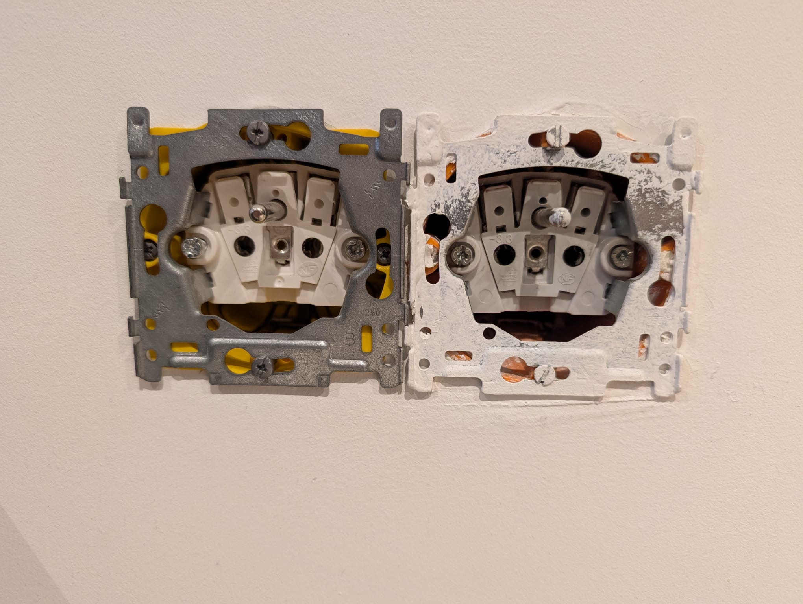
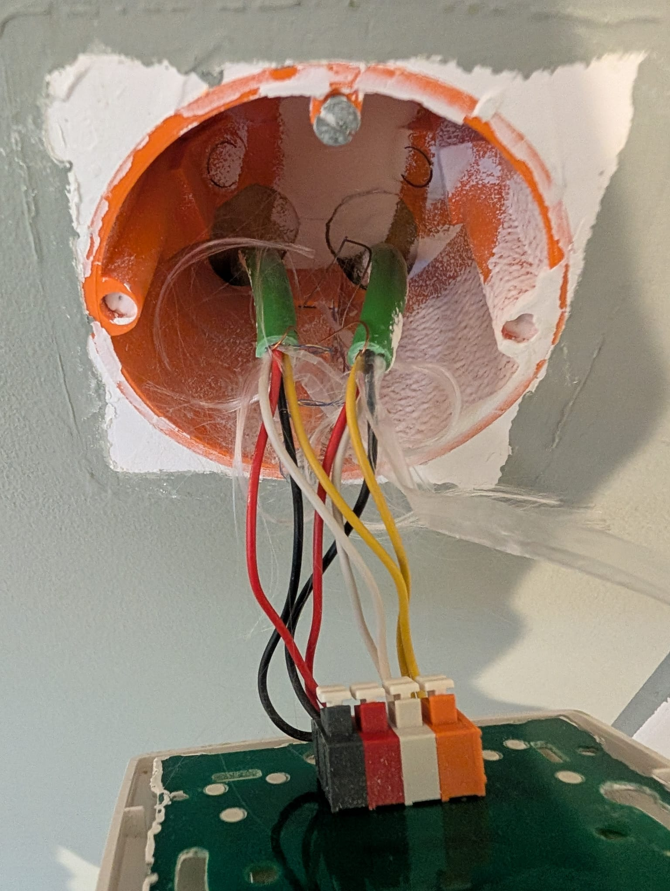
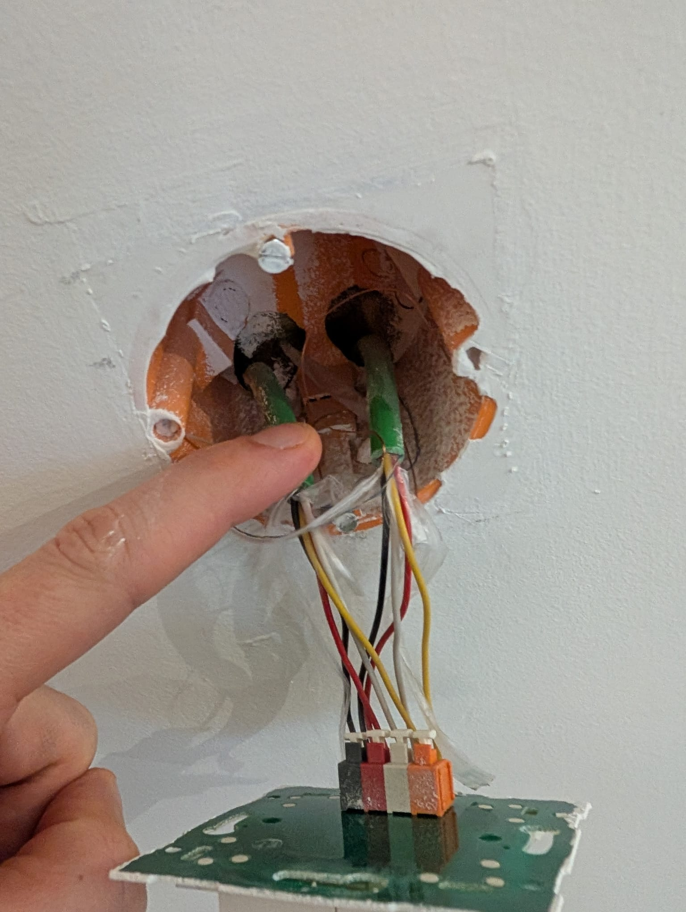
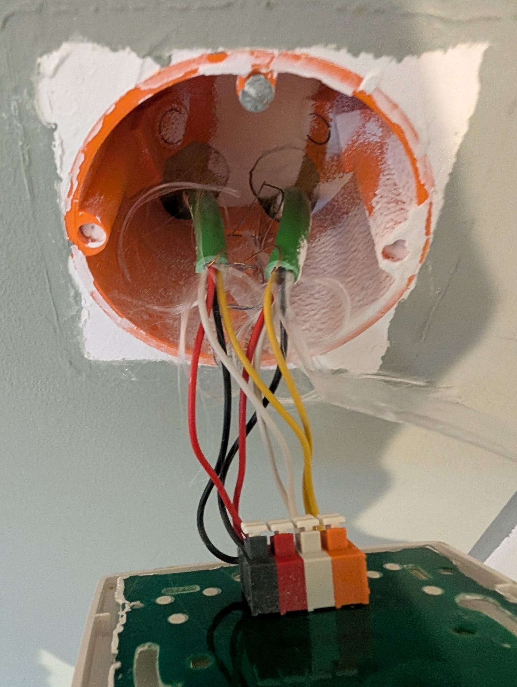
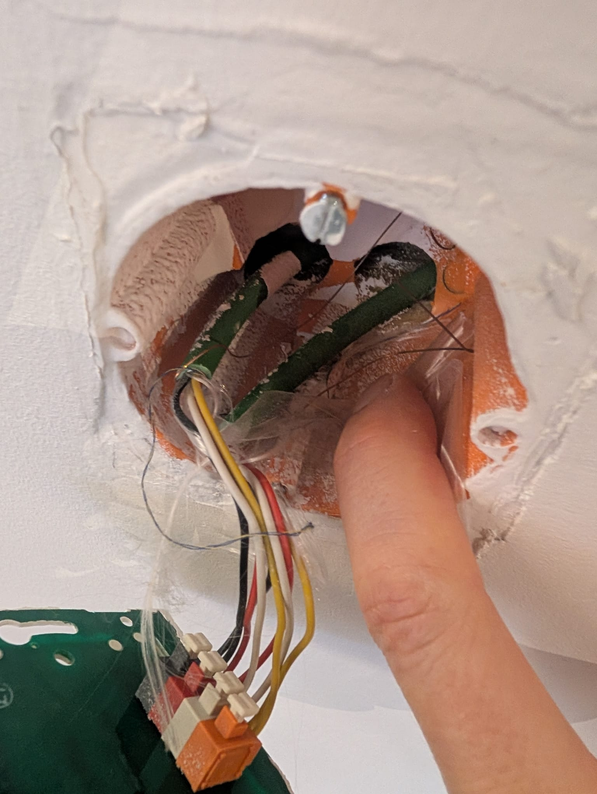
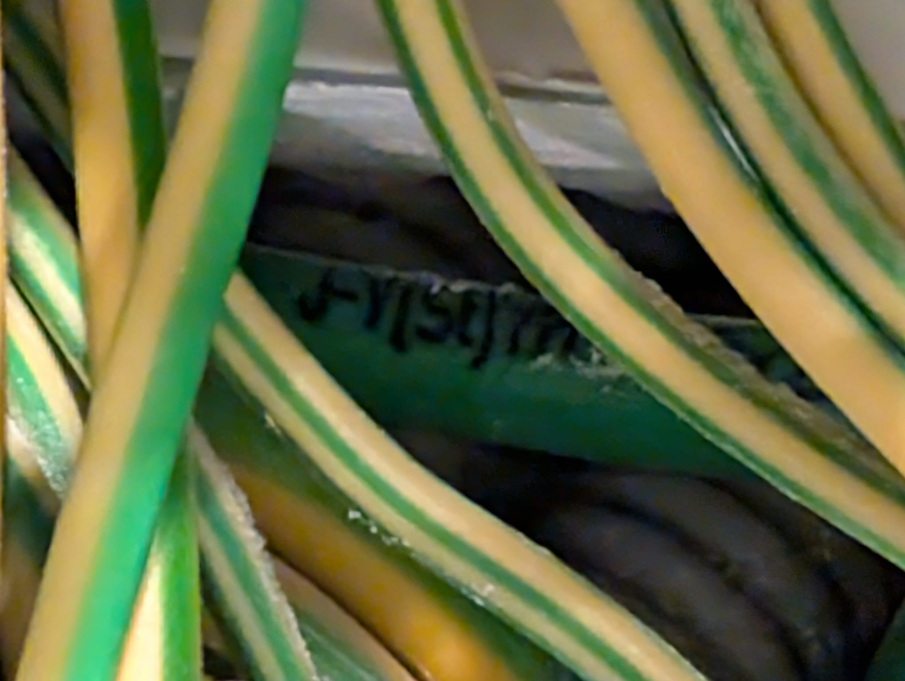

# Apartment Room Layout

## Common

### Distribution Board (DIN-Rail Components)

*   **Cabinet / Multifunction Actuator:** Zennio ALLinBOX 1612 v3 (ZPR1612V3)
    *   *Note:* This unit provides a compact all-in-one solution, including an integrated KNX Power Supply (640 mA) and an IP Interface.
*   **Dimming Actuator:** MDT AKD-0401.02 (4-channel)
    *   *Requirement:* Only **4 dimming channels** are needed, chosen for smooth, flicker-free dimming of LED lights.
    *   *Note:* The overall system has 13 light points (2 outside), but only 4 are currently designated as dimmable via this specific actuator. This implies other light points are switched or dimmed by other means not yet defined.
    *   *Compatibility:* Verify with lamp types (LED, halogen, CFL) for smooth dimming.
*   **KNX Power Supply:** Integrated 640 mA KNX PS (part of Zennio ALLinBOX 1612 v3)
    *   *Adequacy:* Generally sufficient for small-to-medium installations; confirm total bus current draw with ~20–30% headroom after all devices are finalized.
*   **IP Interface / Router:** Integrated IP interface (part of Zennio ALLinBOX 1612 v3)
    *   *Functionality:* Supports ETS programming over IP and remote access/router functionality.
    *   *Security Note:* For remote access outside LAN, consider secure VPN or KNX/IP Secure.

### KNX Dimming Explained

In a KNX system, dimming is handled by the **dimming actuator** (e.g., your MDT AKD-0401.02) located in the electrical cabinet. Your wall switches (MDT Push Button Lite) send digital commands to this actuator, not direct power. This allows for flexible and powerful control.

**How Dimming Works with Your KNX Push Buttons:**

1.  **With a 2-Button Rocker (e.g., Top/Bottom or Left/Right):**
    *   **Short Press (e.g., Top):** Switches the light ON to its last dimming value, or to a pre-set value.
    *   **Short Press (e.g., Bottom):** Switches the light OFF.
    *   **Long Press (e.g., Top):** Dims the light UP (brighter) as long as held.
    *   **Long Press (e.g., Bottom):** Dims the light DOWN (darker) as long as held.

2.  **With a Single Button (One-Button Dimming):**
    *   This is used when only one physical button or rocker position is assigned to a light.
    *   **Short Press:** Toggles the light ON/OFF. (If OFF, turns ON; if ON, turns OFF).
    *   **Long Press:** Dims the light UP or DOWN cyclically. The direction alternates with each long press.
        *   First long press after switching ON: Dims UP.
        *   Next long press: Dims DOWN.
        *   And so on.

This approach provides a clean aesthetic with uniform switches throughout your home and offers high flexibility in programming.

### Installation Note: Replacing Niko with Gira/MDT

*   **Wall Box Compatibility:** The existing side-by-side wall boxes (as seen in the image below) are installed with the standard 71mm center-to-center spacing, which is the universal European standard (DIN 49073).
    
*   **Niko "Hooks":** The specific "dovetail" hooks on your current Niko inserts are brand-specific for interlocking Niko mounting frames. These are *not* required or used by Gira inserts or MDT frames.
*   **Gira/MDT Integration:**
    *   The **Gira inserts** (power, data, mechanical push button) come with their own standard metal mounting frames which screw directly into the existing wall box screw points.
    *   The **MDT 2-gang (or multi-gang) frame** is rigid and is designed to hold the Gira inserts in perfect alignment over the standard 71mm spacing.
*   **Conclusion:** You can confidently replace your existing Niko setup with Gira inserts and MDT frames. The physical mounting and alignment will be fully compatible.

### KNX Cable Identification

*   **Standard Color:** The universally recognized and standard color for KNX bus cable is **green**.
*   **Cable Type:** It is typically a shielded twisted-pair cable (often specified as J-Y(St)Y 2x2x0.8mm). Inside, you'll usually find two pairs of wires:
    *   **Red/Black:** The primary pair for KNX bus data and power.
    *   **Yellow/White:** An auxiliary pair, often unused for bus communication.
*   **Identification:** A green, shielded twisted-pair cable is a strong indicator of KNX. Look for markings on the cable sheath (e.g., "KNX", "EIB", or "J-Y(St)Y") for definitive confirmation.
*   **VERIFICATION (Your Apartment):**
    *   **Visual Evidence of Cabling:** Locations identified as having bus cable:
        
        
        
        
    *   **Confirmed Marking:** Photographic evidence clearly shows the cable sheath marked **`J-Y(St)Y`**.
        
    *   **Good News:** This is the standard specification for KNX bus cable. Even though it was used for Nikobus, **it is fully compatible with your new KNX system.**
    *   **Action:** You can reuse the existing cabling without modification. Simply replace the Nikobus components with your new KNX devices.

### Installation Note: Cabinet Space Confirmed

*   **Available Width:** Analysis of the electrical cabinet image (as seen below) confirms an available DIN rail width of approximately **32.5 cm (325 mm)** on at least one row in your distribution board.
    
*   **KNX Equipment Width:** Your selected KNX central components (Zennio ALLinBOX: 12 TE + MDT AKD-0401.02: 6 TE) require a total of **18 TE**.
*   **Conversion:** 18 TE equates to 18 * 17.5 mm = **315 mm**.
*   **Conclusion:** The available space of 325 mm is sufficient for the 315 mm (18 TE) required, leaving a small buffer for ease of installation.
*   **Action:** The existing Nikobus modules on this rail will need to be removed to free up the 18 TE for the new KNX components.

### Cabinet Requirements (Physical Space)

*   **Total Space Needed:** **18 TE** (DIN rail units)
    *   **Zennio ALLinBOX 1612 v3:** 12 TE
    *   **MDT AKD-0401.02:** 6 TE
*   **Capacity Check:**
    *   **Dimming:** 4 channels (MDT) cover the 4 dimmable circuits.
    *   **Switching:** The Zennio unit has **16 relay outputs**.
        *   **Required:** 9 channels (13 total lights - 4 dimmed).
        *   **Spare:** 7 channels remaining (available for blinds, screens, or switched outlets).
    *   *Conclusion:* The current hardware selection is sufficient for all 13 light points with room for expansion.

### Visualization / App Control

*   **Zennio Hardware:** The Zennio ALLinBOX 1612 v3 allows control via IP but **does not** host a mobile app server itself. To use the official **Zennio Remote** app, a Zennio Touch Panel with a license is typically required.
*   **Server-Based (Best Experience):**
    *   **Home Assistant / OpenHAB:** Free, open-source. Requires a small server (e.g., Raspberry Pi). Connects to the Zennio IP Interface to provide a rich mobile UI, automation, and Apple/Google integration.
*   **Direct Connection / Serverless (For minimalists):**
    *   **EasyKNX (Android):** Connects directly to the IP interface without a server. "Lite" version is free/basic.
    *   **TouchControl (iOS):** Connects directly. Paid app, but no server hardware needed.

### Wiring & Channel Mapping (High Level)

*   The **MDT 4-channel dimmer (AKD-0401.02)** provides the **4 dimming channels** required.
*   The remaining **9 light points** will be switched via the **Zennio ALLinBOX 1612 v3** relays.
*   There are a total of **13 light points (including 2 outside)**. All are covered by the current hardware.
*   **Switch-to-channel assignment:** Detailed per-room mapping to be defined.

## Hall

### Control Points (Switches)
*   **1 x 2-button switch:**
    *   MDT Insert: `BE-TAL55T206.01`
    *   MDT Rocker: `BE-TAL55W206.01`
    *   MDT Frame: `BE-TAL55R1.06` (1-gang, matte black)
*   **1 x 4-button switch:**
    *   MDT Insert: `BE-TAL55T406.01`
    *   MDT Rocker: `BE-TAL55W406.01`
    *   MDT Frame: `BE-TAL55R1.06` (1-gang, matte black)

### Power Outlets (Gira E2 System 55 Inserts, MDT Frames)
*   **1 x Double Power Outlet:**
    *   MDT Frame: 1 x `BE-TAL55R2.06` (2-gang, matte black - *assumed*)
    *   Gira Insert: 2 x Single power outlet (Schuko, Type E)

## WC

### Control Points (Switches)
*   **1 x 2-button switch:**
    *   MDT Insert: `BE-TAL55T206.01`
    *   MDT Rocker: `BE-TAL55W206.01`
    *   MDT Frame: `BE-TAL55R1.06` (1-gang, matte black)

## Storage

### Control Points (Switches)
*   **1 x 2-button switch:**
    *   MDT Insert: `BE-TAL55T206.01`
    *   MDT Rocker: `BE-TAL55W206.01`
    *   MDT Frame: `BE-TAL55R1.06` (1-gang, matte black)

### Power Outlets (Gira E2 System 55 Inserts, MDT Frames)
*   **1 x Double Power Outlet:**
    *   MDT Frame: 1 x `BE-TAL55R2.06` (2-gang, matte black - *assumed*)
    *   Gira Insert: 2 x Single power outlet (Schuko, Type E)

## Kitchen

### Countertop Combo (Switch + 2 Outlets)
*   **1 x 3-Gang Combo:**
    *   MDT Frame: `BE-TAL55R3.06` (3-gang, matte black - *assumed*)
    *   **Slot 1 (Switch for Zigbee):**
        *   Gira Insert: Gira E2 System 55 Mechanical Push Button (single rocker, momentary contact, matte black - *for Zigbee module*)
        *   *Note:* This is a non-KNX mechanical push button, suitable for connecting to a Zigbee module, chosen to match the aesthetic of other components.
    *   **Slots 2 & 3 (Power):**
        *   Gira Insert: 2 x Single power outlet (Schuko, Type E)

### Additional Control Points (KNX Switch)
*   **1 x 4-button switch:**
    *   MDT Insert: `BE-TAL55T406.01`
    *   MDT Rocker: `BE-TAL55W406.01`
    *   MDT Frame: `BE-TAL55R1.06` (1-gang, matte black)

### Additional Power Outlets
*   **1 x Double Power Outlet:**
    *   MDT Frame: 1 x `BE-TAL55R2.06` (2-gang, matte black - *assumed*)
    *   Gira Insert: 2 x Single power outlet (Schuko, Type E)

## Dining Room

### Control Points (Switches)
*   **1 x 4-button switch:**
    *   MDT Insert: `BE-TAL55T406.01`
    *   MDT Rocker: `BE-TAL55W406.01`
    *   MDT Frame: `BE-TAL55R1.06` (1-gang, matte black)

### Power Outlets (Gira E2 System 55 Inserts, MDT Frames)
*   **2 x Double Power Outlets:**
    *   MDT Frame: 2 x `BE-TAL55R2.06` (2-gang, matte black - *assumed*)
    *   Gira Insert: 4 x Single power outlet (Schuko, Type E)

## Living Room

### Control Points (Switches)
*   **1 x 8-button switch:**
    *   MDT Insert: `BE-TA55T806.02` (Push Button Plus 55, 8-fold)
    *   *Note:* Integrated front, no separate rocker needed.
    *   MDT Frame: `BE-TAL55R1.06` (1-gang, matte black)
*   **1 x 4-button switch:**
    *   MDT Insert: `BE-TAL55T406.01`
    *   MDT Rocker: `BE-TAL55W406.01`
    *   MDT Frame: `BE-TAL55R1.06` (1-gang, matte black)

### Power Outlets (Gira E2 System 55 Inserts, MDT Frames)
*   **4 x Double Power Outlets:**
    *   MDT Frame: 4 x `BE-TAL55R2.06` (2-gang, matte black - *assumed*)
    *   Gira Insert: 8 x Single power outlet (Schuko, Type E)

### Data & Media (Gira Inserts, MDT Frames)
*   **1 x Single Dual-FTP Outlet:**
    *   MDT Frame: 1 x `BE-TAL55R1.06` (1-gang, matte black)
    *   Gira Insert: 1 x Dual FTP connector
*   **1 x 2-Gang Combo (FTP + Media):**
    *   MDT Frame: 1 x `BE-TAL55R2.06` (2-gang, matte black - *assumed*)
    *   **Slot 1 (Data):** Gira Insert: Single FTP connector
    *   **Slot 2 (Media):** Gira Insert: Radio/Coax connector

## Overlay (Hall Upstairs)

### Control Points (Switches)
*   **1 x 4-button switch:**
    *   MDT Insert: `BE-TAL55T406.01`
    *   MDT Rocker: `BE-TAL55W406.01`
    *   MDT Frame: `BE-TAL55R1.06` (1-gang, matte black)
*   **1 x 2-button switch:**
    *   MDT Insert: `BE-TAL55T206.01`
    *   MDT Rocker: `BE-TAL55W206.01`
    *   MDT Frame: `BE-TAL55R1.06` (1-gang, matte black)

### Power Outlets (Gira E2 System 55 Insert, MDT Frame)
*   **1 x Single Power Outlet:**
    *   MDT Frame: `BE-TAL55R1.06` (1-gang, matte black)
    *   Gira Insert: Single power outlet (to be specified)

## Bathroom

### Combo Unit (Switch + Power)
*   **1 x 2-Gang Combo:**
    *   MDT Frame: `BE-TAL55R2.06` (2-gang, matte black - *assumed*)
    *   **Slot 1 (Switch):**
        *   MDT Insert: `BE-TAL55T406.01` (4-button)
        *   MDT Rocker: `BE-TAL55W406.01`
    *   **Slot 2 (Power):**
        *   Gira Insert: Single power outlet (Schuko with earthing pin, Type E)

## Bedroom

### Control Points (Switches)
*   **1 x 4-button switch:**
    *   MDT Insert: `BE-TAL55T406.01`
    *   MDT Rocker: `BE-TAL55W406.01`
    *   MDT Frame: `BE-TAL55R1.06` (1-gang, matte black)
*   **1 x 2-button switch:**
    *   MDT Insert: `BE-TAL55T206.01`
    *   MDT Rocker: `BE-TAL55W206.01`
    *   MDT Frame: `BE-TAL55R1.06` (1-gang, matte black)

### Power Outlets & Data (Gira E2 System 55 Inserts, MDT Frames)
*   *Note:* All Gira power outlets are **Schuko with earthing pin (Type E)**.
*   **1 x Single Power Outlet:**
    *   MDT Frame: `BE-TAL55R1.06` (1-gang, matte black)
    *   Gira Insert: Single power outlet (to be specified)
*   **3 x Double Power Outlets:** (Each in its own frame)
    *   MDT Frame: 3 x `BE-TAL55R2.06` (2-gang, matte black - *assumed MDT part number for 55x55 series*)
    *   Gira Insert: 6 x Single power outlet (Schuko, Type E)
*   **Combined Triple Frame (Power & Data):**
    *   MDT Frame: 1 x `BE-TAL55R3.06` (3-gang, matte black - *assumed MDT part number for 55x55 series*)
    *   Gira Insert: 2 x Single power outlet (to be specified)
    *   Gira Insert: 1 x Dual FTP connector (to be specified)

## Office

### Control Points (Switches)
*   **1 x 4-button switch:**
    *   MDT Insert: `BE-TAL55T406.01`
    *   MDT Rocker: `BE-TAL55W406.01`
    *   MDT Frame: `BE-TAL55R1.06` (1-gang, matte black)

### Power & Data (Gira E2 System 55 Inserts, MDT Frames)
*   **1 x Single FTP Outlet:**
    *   MDT Frame: `BE-TAL55R1.06` (1-gang, matte black)
    *   Gira Insert: Single FTP connector (to be specified)
*   **2 x Single Power Outlets:**
    *   MDT Frame: 2 x `BE-TAL55R1.06` (1-gang, matte black)
    *   Gira Insert: 2 x Single power outlet (Schuko, Type E)
*   **1 x Double Power Outlet:**
    *   MDT Frame: 1 x `BE-TAL55R2.06` (2-gang, matte black - *assumed*)
    *   Gira Insert: 2 x Single power outlet (Schuko, Type E)

## Dressing

### Control Points (Switches)
*   **1 x 4-button switch:**
    *   MDT Insert: `BE-TAL55T406.01`
    *   MDT Rocker: `BE-TAL55W406.01`
    *   MDT Frame: `BE-TAL55R1.06` (1-gang, matte black)
*   **1 x 2-button switch:**
    *   MDT Insert: `BE-TAL55T206.01`
    *   MDT Rocker: `BE-TAL55W206.01`
    *   MDT Frame: `BE-TAL55R1.06` (1-gang, matte black)

### Power Outlets (Gira E2 System 55 Inserts, MDT Frames)
*   **2 x Single Power Outlets:**
    *   MDT Frame: 2 x `BE-TAL55R1.06` (1-gang, matte black)
    *   Gira Insert: 2 x Single power outlet (Schuko, Type E)
*   **1 x Double Power Outlet:**
    *   MDT Frame: 1 x `BE-TAL55R2.06` (2-gang, matte black - *assumed*)
    *   Gira Insert: 2 x Single power outlet (Schuko, Type E)

## Bill of Materials (BOM)

### Central System (DIN-Rail)
| Component | Model / Description | Quantity |
| :--- | :--- | :--- |
| **Multifunction Actuator** | Zennio ALLinBOX 1612 v3 (ZPR1612V3) | 1 |
| **Dimming Actuator** | MDT AKD-0401.02 (4-channel) | 1 |

### MDT Control Points (Black Matt)
| Type | Insert Part # | Rocker Part # | Quantity |
| :--- | :--- | :--- | :--- |
| **2-button Switch** | `BE-TAL55T206.01` | `BE-TAL55W206.01` | **6** |
| **4-button Switch** | `BE-TAL55T406.01` | `BE-TAL55W406.01` | **9** |
| **8-button Switch** | `BE-TA55T806.02` | *(Integrated)* | **1** |

### MDT Frames (Assortment 55 - Black Matt)
| Size | Part # (Assumed) | Usage Count | Total Quantity |
| :--- | :--- | :--- | :--- |
| **1-gang Frame** | `BE-TAL55R1.06` | 23 | **23** |
| **2-gang Frame** | `BE-TAL55R2.06` | 16 | **16** |
| **3-gang Frame** | `BE-TAL55R3.06` | 2 | **2** |

### Gira Inserts (System 55 - Black Matt)
| Component | Description | Quantity |
| :--- | :--- | :--- |
| **Power Outlet** | Single Socket (Schuko, Type E, Screw Terminals recommended) | **39** |
| **Mechanical Switch** | Single Rocker Push Button (Momentary Contact) | **1** |
| **Dual Data** | Dual FTP/RJ45 Connector | **2** |
| **Single Data** | Single FTP/RJ45 Connector | **2** |
| **Media** | Radio/TV Coax Connector | **1** |

## Visual Verification & Reference

### Compatibility Note
*   **System 55 Standard:** Both MDT 55mm frames and Gira System 55 inserts adhere to the same physical standard (55x55mm internal dimension). They are mechanically compatible.
*   **Finish Match:** Both the MDT "Assortment 55" frames in **Matte Black** and Gira E2 "System 55" inserts in **Black Matt** are designed for a modern, flat matte look. They are widely considered a near-perfect visual match.

### Component Image Search Links
Use these links to view the specific aesthetics of the parts:

#### MDT Components (Black Matt)
*   **Push Button Lite (4-fold):** [View Images (BE-TAL55T406.01)](https://www.google.com/search?tbm=isch&q=MDT+BE-TAL55T406.01+black)
*   **Push Button Lite (2-fold):** [View Images (BE-TAL55T206.01)](https://www.google.com/search?tbm=isch&q=MDT+BE-TAL55T206.01+black)
*   **Push Button Plus (8-fold):** [View Images (BE-TA55T806.02)](https://www.google.com/search?tbm=isch&q=MDT+BE-TA55T806.02+black)
*   **Frames (55mm Black Matt):** [View Images (BE-TAL55R1.06)](https://www.google.com/search?tbm=isch&q=MDT+BE-TAL55R1.06+black+matt)

#### Gira System 55 Inserts (Black Matt)
*   **Power Outlet (Schuko Type E):** [View Images (Gira System 55 Schuko E black matt)](https://www.google.com/search?tbm=isch&q=Gira+System+55+Schuko+Type+E+pin+earth+black+matt)
*   **Mechanical Push Button:** [View Images (Gira System 55 Rocker black matt)](https://www.google.com/search?tbm=isch&q=Gira+System+55+rocker+switch+black+matt)
*   **Data/Coax Inserts:** [View Images (Gira System 55 Data Socket black matt)](https://www.google.com/search?tbm=isch&q=Gira+System+55+UAE+data+socket+black+matt)

#### Central Components
*   **Zennio ALLinBOX 1612 v3:** [View Images](https://www.google.com/search?tbm=isch&q=Zennio+ZPR1612V3)
*   **MDT Dimmer (AKD-0401.02):** [View Images](https://www.google.com/search?tbm=isch&q=MDT+AKD-0401.02)

