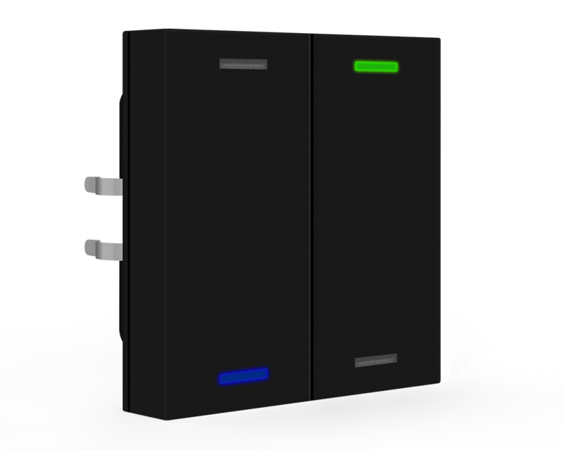
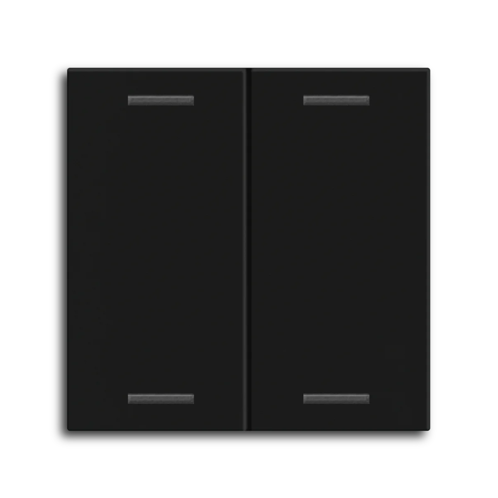
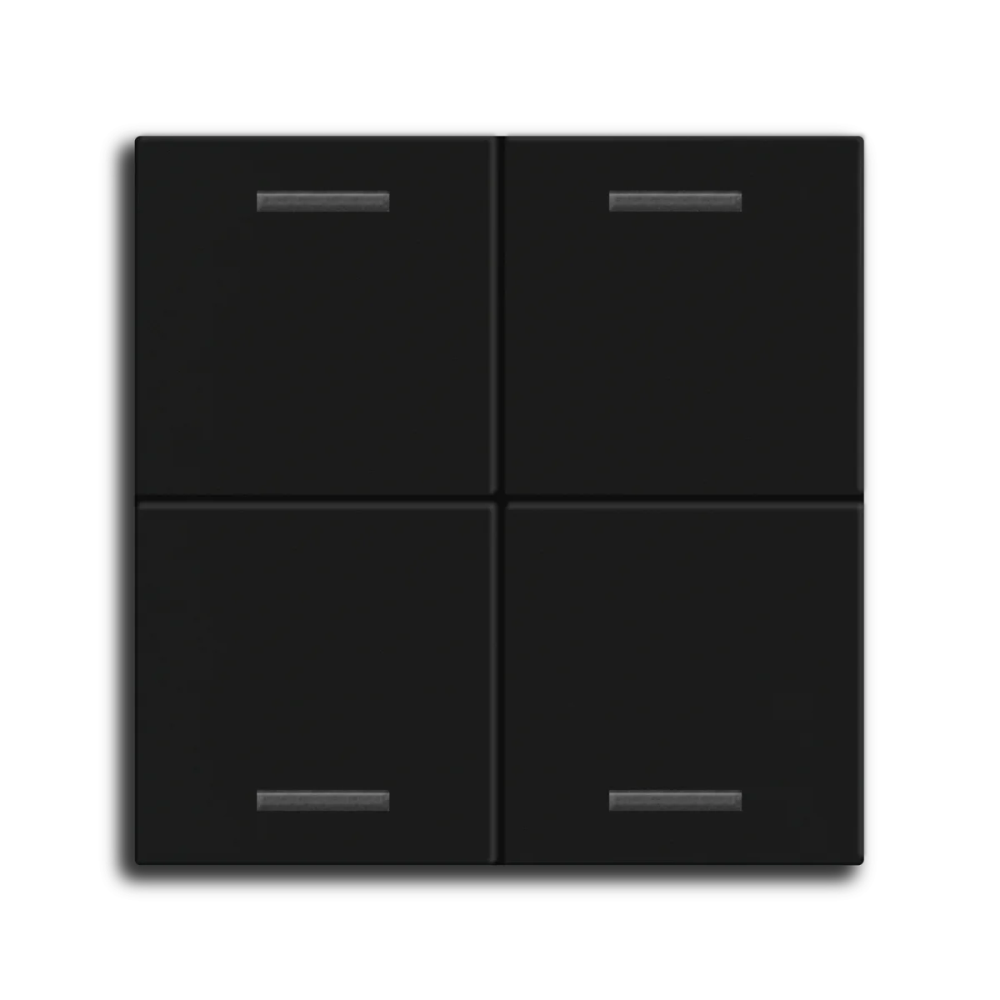
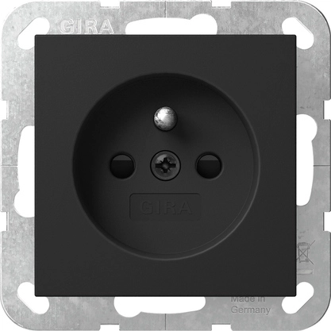
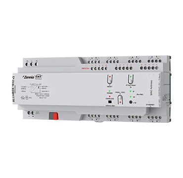
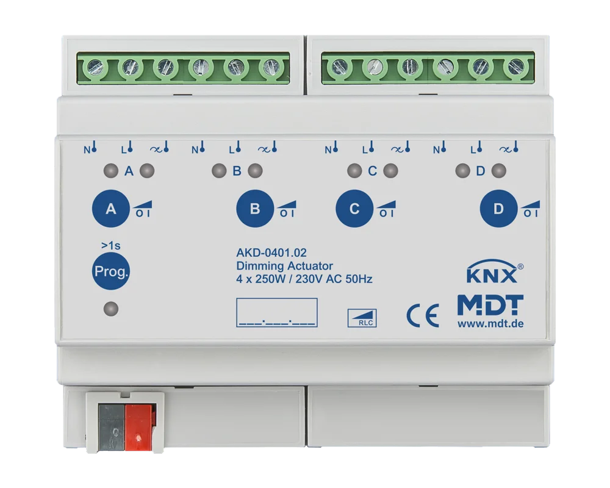

## Visual Verification & Reference

### Compatibility Note
*   **System 55 Standard:** Both MDT 55mm frames and Gira System 55 inserts adhere to the same physical standard (55x55mm internal dimension). They are mechanically compatible.
*   **Finish Match:** Both the MDT "Assortment 55" frames in **Matte Black** and Gira E2 "System 55" inserts in **Black Matt** are designed for a modern, flat matte look. They are widely considered a near-perfect visual match.

### Component Image Search Links
Use these links to view the specific aesthetics of the parts:

#### MDT Components (Black Matt)

| 2-fold Lite (Insert + Rocker) | 4-fold Lite (Insert + Rocker) | 8-fold Plus (Integrated) |
| :---: | :---: | :---: |
| **[Insert Link](https://smartkram.de/shop/smart-home/tastsensoren-und-bedienelemente/tastsensoren/mdt-knx-taster-2-fach-light-55-schwarz-matt-neutral-be-tal550206-01/)** / **[Rocker Link](https://my-knx-shop.net/MDT-BE-TAL55W206.01-MDT-Wippe-fuer-KNX-Taster-Light-55-2-fach,-Schwarz-matt,-Neutral)**    | **[Insert Link](https://smartkram.de/shop/smart-home/tastsensoren-und-bedienelemente/tastsensoren/mdt-knx-taster-4-fach-light-55-schwarz-matt-neutral-be-tal550406-01/?srsltid=AfmBOopDyvbb1PPW3VwE2SYJn0rSvLs_THBg7Lm8PbHKmpTTPHalC_dk)** / **[Rocker Link](https://my-knx-shop.net/MDT-BE-TAL55W406.01-MDT-Wippe-fuer-KNX-Taster-Light-55-4-fach,-Schwarz-matt,-Neutral)**    | **[Product Page](https://my-knx-shop.net/MDT-BE-TA55T806.02-KNX-Taster-Plus-TS-55-8-fach,-Schwarz-matt)**   |

*   **Frames (Gira E2 Black Matt):** [Product Page (Gira)](https://partner.gira.com/en/design-system/designlines/gira-e2.html)   Part #: 021109 (1g), 021209 (2g), 021309 (3g)

#### Gira System 55 Inserts (Black Matt)
*   **Power Outlet (Schuko Type E):** [Product Page (Klusspullen)](https://www.klusspullen.nl/gira-4485005-553469.html)
    
*   **Mechanical Push Button Mechanism:** [View Images (Gira 0130005)](https://www.google.com/search?tbm=isch&q=Gira+0130005+Taster+Einsatz+schwarz+matt)
*   **Mechanical Push Button Rocker:** [View Images (Gira 0296005)](https://www.google.com/search?tbm=isch&q=Gira+0296005+Wippe+schwarz+matt)
*   **Data/Coax Inserts:** [View Images (Gira System 55 Data Socket black matt)](https://www.google.com/search?tbm=isch&q=Gira+System+55+UAE+data+socket+black+matt)

#### Central Components

| Zennio ALLinBOX 1612 v3 | MDT Dimmer (AKD-0401.02) |
| :---: | :---: |
| **[Product Page](https://my-knx-shop.net/Zennio-ZPR1612V3-KNX-ALLinBOX-1612-Multifunktionsgeraet-mit-Spannungsversorgung,-KNX-IP-Schnittstelle,-16-OUT,-12-IN,-Logikmodul)**   | **[Product Page](https://my-knx-shop.net/Dimming-Actuator-4-fold,-6SU-MDRC,-250W,-230VAC,-with-active-power-measurement)**   |